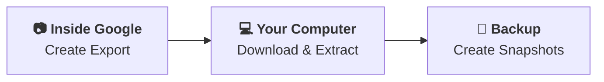

import Callout from "@marketing/components/Callout.astro";
import BlogFaq from "@marketing/components/BlogFaq.astro";
import Summary from "@marketing/components/Summary.astro";
import { Checkbox } from "@blinkdisk/ui/checkbox";
import ListChecksIcon from "@lucide/astro/icons/list-checks";
import { Image } from "astro:assets";

<Summary>
  To backup photos from Google Photos, export your library with Google Takeout, download every archive before it expires, extract the files, keep the JSON metadata sidecars, and store the result in a separate encrypted backup.
</Summary>

Google Photos is convenient until you need a copy that lives outside Google. Maybe you are cleaning up an old account, preparing to leave Google Photos, protecting family photos from account trouble, or just trying to make sure one mistaken delete does not wipe out years of memories.

This guide walks through the workflow end to end: Google Takeout for the export, a local staging drive for the download, and a real backup target for long-term protection.



## Why Is Google Photos Backup Not a Real Backup?

Google Photos "Backup" feature uploads photos and videos into Google's cloud, but it does not create an independent, restorable copy outside Google. In a 2022 Backblaze survey of 2,068 U.S. adults, 54% reported data loss and only 10% backed up daily ([Backblaze, "The 2022 Backup Survey," retrieved May 16, 2026](https://www.backblaze.com/blog/the-2022-backup-survey-54-report-data-loss-with-only-10-backing-up-daily/)). A real backup follows the 3-2-1 idea: separate copies, separate storage, and recoverable history in case the account, sync state, or original files change.

<Callout variant="warning" title="Sync is not a backup">
  <p>
    In Google Photos, "Backup" means your phone uploads photos to Google's cloud. That is useful sync. It does not give you an independent copy outside Google, and it does not protect you if [your Google Account gets banned](https://theywillbanyou.com/), you accidentally delete photos, or you want to leave Google Photos later.
   
    Accidental deletion is the single biggest cause of data loss in a 2025 Handy Recovery survey of 1,000 U.S. adults ([Handy Recovery, "The Data Loss Survey," retrieved May 16, 2026](https://www.handyrecovery.com/data-loss-statistics/)). 

    If you want the deeper distinction, read [Sync vs Backup](/blog/sync-vs-backup).
  </p>
</Callout>

Google Photos can also remove local device copies after they are backed up. Google's <a href="https://support.google.com/photos/answer/6128843?hl=en">Free up space on your device</a> help page says the feature deletes photos from your device, while photos and videos that are fewer than 30 days old may be retained there. That saves phone storage, but once the device copy is gone, the practical copy you depend on may live only in Google's cloud.

A real backup is separate from the original system and should follow the [3-2-1 backup rule](/glossary/what-is-the-3-2-1-backup-rule). Drive failure is not theoretical: Backblaze's 2025 drive report analyzed 344,196 hard drives and found a 1.36% annualized failure rate across the year ([Backblaze, "Drive Stats for 2025," retrieved May 16, 2026](https://www.backblaze.com/blog/backblaze-drive-stats-for-2025/)). For Google Photos, that means exporting your photos out of Google, storing them somewhere else, and keeping historical copies you can restore later.

## What Do You Need Before You Back Up Google Photos?

Before you back up Google Photos, prepare four things: a computer that can stay awake, a stable internet connection, staging storage with roughly 2x your reported library size, and backup software that can store encrypted snapshots.

<div className="not-prose relative my-6 overflow-hidden rounded-xl border border-primary/20 bg-card shadow-sm">
  <div className="absolute left-0 top-0 h-full w-1 bg-gradient-to-b from-primary to-accent"></div>
  <div className="px-5 pb-4 pt-5 sm:px-6">
    <div className="flex items-start gap-3">
      <div className="flex size-9 shrink-0 items-center justify-center rounded-lg border border-primary/20 bg-primary/10 text-primary">
        <ListChecksIcon className="size-5" />
      </div>
      <div>
        <p className="text-xs font-bold uppercase tracking-widest text-primary">Before you export</p>
        <p className="mt-1 text-base font-semibold leading-6 text-foreground">Pre-flight checklist</p>
        <p className="mt-1 text-sm leading-6 text-muted-foreground">Tick these off before you start the export.</p>
      </div>
    </div>
  </div>
  <div className="grid border-t border-border/80 p-3">
  <label htmlFor="takeout-checklist-computer" className="group flex cursor-pointer items-start gap-3 rounded-md border border-transparent px-3 py-2.5 transition-colors hover:border-primary/20 hover:bg-primary/5">
    <Checkbox id="takeout-checklist-computer" className="mt-1" client:load />
    <span className="flex-1">
      <span className="block font-medium text-foreground">A computer that can stay awake</span>
      <span className="mt-0.5 block text-sm text-muted-foreground">Long downloads should not be interrupted by sleep mode.</span>
    </span>
  </label>
  <label htmlFor="takeout-checklist-internet" className="group flex cursor-pointer items-start gap-3 rounded-md border border-transparent px-3 py-2.5 transition-colors hover:border-primary/20 hover:bg-primary/5">
    <Checkbox id="takeout-checklist-internet" className="mt-1" client:load />
    <span className="flex-1">
      <span className="block font-medium text-foreground">A fast internet connection</span>
      <span className="mt-0.5 block text-sm text-muted-foreground">Large Takeout archives are easier to finish on stable bandwidth.</span>
    </span>
  </label>
  <label htmlFor="takeout-checklist-storage" className="group flex cursor-pointer items-start gap-3 rounded-md border border-transparent px-3 py-2.5 transition-colors hover:border-primary/20 hover:bg-primary/5">
    <Checkbox id="takeout-checklist-storage" className="mt-1" client:load />
    <span className="flex-1">
      <span className="block font-medium text-foreground">Enough staging storage</span>
      <span className="mt-0.5 block text-sm text-muted-foreground">Use an external drive, NAS, or local disk with room for archives and extracted files.</span>
    </span>
  </label>
  <label htmlFor="takeout-checklist-backup" className="group flex cursor-pointer items-start gap-3 rounded-md border border-transparent px-3 py-2.5 transition-colors hover:border-primary/20 hover:bg-primary/5">
    <Checkbox id="takeout-checklist-backup" className="mt-1" client:load />
    <span className="flex-1">
      <span className="block font-medium text-foreground">Real backup software</span>
      <span className="mt-0.5 block text-sm text-muted-foreground">
        Use something like <a href="/" target="_blank" rel="noreferrer">BlinkDisk</a> for encrypted, deduplicated backup snapshots.
      </span>
    </span>
  </label>
  </div>
</div>

<Callout variant="warning" title="Plan for extra storage">
  <p>
    Google Takeout exports can be much bigger than the storage number shown in Google Photos because Takeout may include additional copies and files that do not count against your Google storage quota. Plan for more free space than Google says you use.
  </p>
  <p>
    Standard smartphone photos run 2–5 MB each, and a single minute of 4K video takes 400–600 MB ([SamMobile, "How much storage do photos and videos actually use?," retrieved May 16, 2026](https://www.sammobile.com/news/how-much-storage-do-photos-and-videos-actually-use/)). A library that Google reports as 200 GB can easily need 400+ GB of staging space once you account for both the zip files and the extracted folders.
  </p>
</Callout>

## How Do You Create a Google Takeout Export?

Create the export in [Google Takeout](https://takeout.google.com/) from the Google account that owns the Photos library. Select only Google Photos, keep the default media formats, choose zip files, and use the largest archive size available so a large library turns into fewer downloads.

### Select Google Photos

In the **Select data to include** section, click **Deselect all** in the top right. Most Google products are selected by default, and you do not want a huge export full of unrelated account data.

<Image src="https://static.blinkdisk.com/blog/google-photos/deselect-all.jpg" width={1700} height={900} alt="Google Takeout screen with the Deselect all button highlighted" />

Scroll to **Google Photos** and select the checkbox to the right of **Google Photos**.

<Image src="https://static.blinkdisk.com/blog/google-photos/select-google-photos.jpg" width={1700} height={900} alt="Google Takeout screen with Google Photos selected" />

Leave **Multiple formats** at the default settings. That menu controls photo, video, and metadata formats, and the defaults are the safest choice for a faithful export.

<Image src="https://static.blinkdisk.com/blog/google-photos/formats.jpg" width={1700} height={900} alt="Google Photos Multiple formats settings in Google Takeout" />

The **All photo albums included** button opens the album selector. It includes regular albums and generated entries such as **Photos from 2024**, **Photos from 2025**, and other year folders. For backup purposes, exporting everything is safer than selecting only the auto-created "Photos from year" entries. Google Photos can store files in albums, shared albums, and other generated folders. You want the full Takeout output, then let your backup software deduplicate repeated files later.

<Image src="https://static.blinkdisk.com/blog/google-photos/albums.jpg" width={1700} height={900} alt="Google Photos album selector in Google Takeout" />

Scroll to the bottom and click **Next step**.

<Image src="https://static.blinkdisk.com/blog/google-photos/next-step.jpg" width={1700} height={900} alt="Google Takeout Next step button" />

### Configure the export

The next Takeout screen is **Choose file type, frequency & destination**. This is where you choose how Google delivers the export and how large each archive file can be.

The **Transfer to** dropdown includes options such as **Send download link via email**, **Add to Drive**, **Add to Dropbox**, and **Add to Box**. For a backup, the email download link is usually the cleanest option because you can download the archives straight to your staging drive instead of first copying them into another cloud account.

<Image src="https://static.blinkdisk.com/blog/google-photos/transfer-to.jpg" width={1700} height={900} alt="Google Takeout Transfer to dropdown set to send download link via email" />

For **Frequency**, choose **Export once** if you are making a one-time archive or testing the workflow for the first time. Choose **Export every 2 months for 1 year** if you want Google to generate six exports on a schedule. Recurring exports still require manual downloads, so do not treat that option as automatic backup.

<Image src="https://static.blinkdisk.com/blog/google-photos/frequency.jpg" width={1700} height={900} alt="Google Takeout Frequency dropdown with export options" />

For **File type**, choose `.zip` unless you specifically prefer `.tgz` and know your restore tools handle it well. Zip files are easier for most people to open on macOS, Windows, and Linux.

<Image src="https://static.blinkdisk.com/blog/google-photos/file-type.jpg" width={1700} height={900} alt="Google Takeout File type dropdown set to zip" />

For **File size**, choose the largest archive size available to you.

<Image src="https://static.blinkdisk.com/blog/google-photos/file-size.jpg" width={1700} height={900} alt="Google Takeout File size dropdown with archive size options" />

After you choose the settings, click **Create export**.

<Image src="https://static.blinkdisk.com/blog/google-photos/create-export.jpg" width={1700} height={900} alt="Google Takeout Create export button" />

## What Google Takeout Archive Size Should You Choose?

Choose the largest Google Takeout archive size available to you, usually 50 GB. Smaller archive sizes create more files, which means more clicks, more download time, and more chances to miss one archive. In our test export, the largest archive size made the final download audit easier.

The **File size** dropdown may offer 1 GB, 2 GB, 4 GB, 10 GB, and 50 GB. The size you pick decides how many archive files a large Google Photos library turns into:

| Archive size | 200 GB library | 500 GB library |
| --- | --- | --- |
| 2 GB (default) | ~100 files | ~250 files |
| 4 GB | ~50 files | ~125 files |
| 10 GB | ~20 files | ~50 files |
| 50 GB (recommended) | ~4 files | ~10 files |

Google specifically recommends the 50 GB size limit to decrease the chance that archives are split ([Google Account Help, "How to download your Google data," retrieved May 16, 2026](https://support.google.com/accounts/answer/3024190?hl=en-GB)).

## How Long Does Google Takeout Take for Google Photos?

Google Takeout can take minutes, hours, or several days to prepare a Google Photos export. Small libraries may finish quickly, medium libraries often take several hours, and large libraries commonly take one to three days. Wait for Google's completion email before scheduling the download.

<Image src="https://static.blinkdisk.com/blog/google-photos/created.jpg" width={1700} height={900} alt="Google Takeout export created message explaining that the export can take hours or days" />

The timing depends on the size of your photo library, Google's server load, and the export settings you selected. As a rough guide:

| Library size | Typical Takeout processing time |
| --- | --- |
| Small (< 10 GB) | Minutes to ~2 hours |
| Medium (10-100 GB) | Several hours |
| Large (100 GB-1 TB) | 1-3 days |
| Very large (> 1 TB) | 3+ days |

Wait for the completion email before you plan the download session. That email contains the link back to your Takeout export.

<Image src="https://static.blinkdisk.com/blog/google-photos/email.jpg" width={1165} height={736} alt="Google Takeout email notifying that the export is ready to download" />

## How Do You Download All Google Takeout Archives?

Download every Takeout archive into one staging folder on a drive with enough free space for the complete export. If Google creates seven zip files, all seven must finish downloading before extraction. Missing one archive can leave gaps in years, albums, videos, or metadata sidecar files.

1. Open the link from the email in your browser.
2. Press the first **Download** button.
3. In the save file dialog, navigate to the folder where you want to store the archives. Make sure that drive has enough free space.
4. Repeat steps 2 and 3 for every archive file.
5. Keep the computer awake until all downloads finish.

<Image src="https://static.blinkdisk.com/blog/google-photos/completed.jpg" width={1700} height={900} alt="Google Takeout export page showing a completed Google Photos export ready to download" />

Do not start extracting until every zip file is downloaded. After the download completes, count the files and compare them with Google's export page. If Takeout says there are seven archives, make sure all seven are present before moving on.

Do not wait too long to download the files. Google says Takeout archives expire in about 7 days and each archive can be downloaded only 5 times before you need to request another export ([Google Account Help, "How to download your Google data," retrieved May 16, 2026](https://support.google.com/accounts/answer/3024190?hl=en-GB)).

## How Do You Extract Google Takeout Files?

Extract all Takeout archives into one merged destination folder, then keep both the media files and the `.json` sidecar files. Google Photos can place dates, location edits, descriptions, and other details in those JSON files, so deleting them reduces what a future restore or migration can recover.

### How to unzip Google Takeout on Windows

1. Put all the Google Takeout `.zip` files in one folder.
2. Create a destination folder called `Google Takeout Extracted`, for example `C:\Users\Simon\Downloads\Google Takeout Extracted`.
3. Right-click the first archive and choose **Extract All...**.
4. Click **Browse...** and select the same destination folder.
5. Repeat for each remaining `.zip` file, always choosing that same destination folder.
6. When Windows asks about duplicate files, choose **Skip**.

### How to unzip Google Takeout on macOS

1. Create a folder called `Google Takeout Extracted`.
2. Move all Takeout `.zip` archives into it.
3. Select all archives.
4. Right-click and choose **Open With -> Archive Utility**.
5. When extraction is done, delete the `.zip` files, leaving the combined extracted folder contents behind.

### How to unzip Google Takeout on Linux

Create a merged destination folder called `google-takeout-extracted`, then unzip each Takeout archive into it:

```bash
mkdir -p ~/Downloads/google-takeout-extracted

for z in ~/Downloads/takeout-*.zip; do
  unzip -n "$z" -d ~/Downloads/google-takeout-extracted
done
```

### Keep the JSON metadata files

Google Takeout separates some Google Photos metadata into `.json` sidecar files, so your backup should preserve both the media files and their matching JSON files. Do not delete the JSON files just because they are not photos; our test export had enough of them that they looked like clutter at first.

This messiness is normal. Google Photos stores dates, location edits, descriptions, and other details outside the original file in some cases. For a backup, you usually do not need to repair EXIF metadata immediately. Keep the files as exported. If you ever migrate into another photo app, you can decide then whether to use a metadata repair tool.

## How Do You Back Up the Extracted Google Photos Folder?

Back up the extracted Takeout folder with software that creates encrypted, versioned snapshots you can restore later. The important distinction is that the folder now lives outside Google Photos; backing it up separately gives you an independent copy with history instead of another sync-only copy. 

A Mixbook survey reported by TechRadar in 2023 found that only 35% of respondents regularly backed up camera-roll photos, while the average phone held 3,139 pictures and videos ([TechRadar, "Are you backing up your photos? This survey says most of us aren't," retrieved May 16, 2026](https://www.techradar.com/news/are-you-backing-up-your-photos-this-survey-says-most-of-us-arent)).

Use a backup app that encrypts files before upload, keeps versioned snapshots, and deduplicates repeated Takeout files so copied photos do not waste storage. If you want to compare options first, use the [backup software finder](/finder) to find the right tool for your setup.

### Back Up the Folder with BlinkDisk

To follow these steps, [download BlinkDisk](/download), open the desktop app, and sign up for an account.

After signing in, create a vault. A vault is the encrypted backup space where your snapshots are stored.

You can choose a storage destination for the vault. The default option, CloudBlink, works without additional setup, or you can choose another supported storage provider if you prefer.

Enter an encryption password. This password encrypts your files before they are backed up, so store it somewhere safe.

<Image src="https://static.blinkdisk.com/blog/blinkdisk-create-vault.jpg" width={1920} height={1080} alt="BlinkDisk create vault screen with CloudBlink selected as the storage destination" />

After the vault is created, press **Add folder** and select the extracted Takeout folder you created in the previous step.

<Image src="https://static.blinkdisk.com/blog/google-photos/blinkdisk-add-folder.jpg" width={1920} height={1080} alt="BlinkDisk add folder dialog with a Google Photos Takeout folder selected" />

When the folder is added, press **Backup folder** to create the first encrypted backup.

<Image src="https://static.blinkdisk.com/blog/google-photos/blinkdisk-backup-list.jpg" width={1920} height={1080} alt="BlinkDisk backup list showing the Google Photos Takeout folder ready to back up" />

Your Google Photos export now has an encrypted backup snapshot outside Google.

## Frequently Asked Questions

<BlogFaq faqs={frontmatter.faqs} />
