What is a differential backup? It's a smart middle ground between full and incremental backups that many users find ideal for their needs. This backup type captures everything that's changed since your last full backup, giving you faster restores without the storage overhead of daily full backups.

Differential backup offers the best of both worlds. You get reasonable backup speeds and storage usage, plus a much simpler restoration process compared to incremental strategies.

## How Differential Backups Work

A differential backup starts with a complete full backup as its foundation. Every subsequent differential backup then copies all files that have changed since that initial full backup, not just since the last backup.

Think of it like adding layers to a stack. Your full backup is the base layer. Each differential backup adds another layer containing everything new or modified since the base. Unlike incremental backups, each differential layer grows larger as more files change over time.

The process is straightforward. Your backup software compares the current state of your files against the last full backup. Any file with a different timestamp, size, or checksum gets included in the differential backup.

```mermaid
flowchart LR
    subgraph week["Weekly Backup Cycle"]
        full["📦 Full Backup<br/>Sunday<br/><i>All 100GB</i>"]
        mon["📄 Monday<br/><i>2GB since Sunday</i>"]
        tue["📄 Tuesday<br/><i>3GB since Sunday</i>"]
        wed["📄 Wednesday<br/><i>6GB since Sunday</i>"]
        thu["📄 Thursday<br/><i>7GB since Sunday</i>"]
        fri["📄 Friday<br/><i>9GB since Sunday</i>"]
    end

    full --> mon
    full --> tue
    full --> wed
    full --> thu
    full --> fri

    restore["🔄 To Restore Friday:<br/>Need Full + Friday Only"]
    fri -.-> restore
```

## Advantages of Differential Backups

Differential backups offer several compelling benefits that make them popular for many backup scenarios.

| Advantage               | Why It Matters                                           |
| ----------------------- | -------------------------------------------------------- |
| **Faster Restores**     | Only needs the full backup plus the latest differential  |
| **Moderate Speed**      | Faster than full backups, though slower than incremental |
| **Reasonable Storage**  | Uses less space than full backups, more than incremental |
| **Simpler Management**  | No long chains of dependent backups to track             |
| **Good Recovery Point** | Captures all changes since the full backup               |

The restoration process is where differential backups truly shine. You only need two backup files: the original full backup and the most recent differential backup. This simplicity reduces the risk of restore failures and gets you back to work faster.

## Disadvantages of Differential Backups

Despite their benefits, differential backups have some trade-offs worth considering.

| Disadvantage                      | Impact                                                   |
| --------------------------------- | -------------------------------------------------------- |
| **Growing Backup Size**           | Each differential gets larger until the next full backup |
| **More Storage Than Incremental** | Keeps duplicate copies of files changed multiple times   |
| **Slower Than Incremental**       | Takes longer to complete as the backup period progresses |
| **Bandwidth Usage**               | Larger files mean more data to upload for cloud backups  |

As time passes between full backups, each differential backup grows larger. By the end of the week, your Friday differential backup might be nearly as large as a full backup. This growth pattern affects both storage costs and backup duration.

## Differential vs Other Backup Types

Understanding how differential backups compare helps you choose the right strategy.

| Backup Type      | What Gets Backed Up         | Storage Used | Restore Files Needed |
| ---------------- | --------------------------- | ------------ | -------------------- |
| **Full**         | Every selected file         | Highest      | 1                    |
| **Differential** | All changes since last full | Medium       | 2                    |
| **Incremental**  | Changes since any backup    | Lowest       | All since full       |

### Full Backups

Full backups provide complete protection but require the most time and storage. They're essential as the foundation for both differential and incremental strategies.

### Incremental Backups

Incremental backups are the most storage-efficient option. However, restoring requires the full backup plus every incremental backup made since then, creating a dependency chain.

### Differential Backups

Differential backups hit the sweet spot for many users. They offer better restore simplicity than incremental while using less storage than repeated full backups.

## When to Use Differential Backups

Certain scenarios make differential backups the ideal choice.

**Weekly Backup Cycles**: If you perform full backups weekly, differential backups work perfectly for daily protection in between. They provide good restore speed without the complexity of incremental chains.

**Medium-Sized Datasets**: When you have moderate amounts of data with regular changes, differential backups balance efficiency and simplicity well.

**Frequent Restores Needed**: If you often need to restore files or systems, the two-file restore process saves significant time compared to incremental strategies.

**Cloud Backup Scenarios**: When uploading to cloud storage, differential backups reduce bandwidth usage compared to full backups while maintaining simpler restore procedures.

## Best Practices for Differential Backups

Follow these guidelines to maximize the effectiveness of your differential backup strategy.

**Schedule Regular Full Backups**: Reset your differential baseline weekly or bi-weekly. This prevents backups from growing too large and keeps restore times reasonable.

**Monitor Backup Growth**: Watch how large your differential backups become. If they're approaching full backup size, it's time for a new full backup.

**Test Your Restores**: Regularly practice restoring from your full plus differential backup combination. Ensure the process works smoothly before you need it in an emergency.

**Combine with Incrementals**: Some advanced strategies use monthly full backups, weekly differentials, and daily incrementals for optimal efficiency.

**Encrypt Your Data**: Always encrypt backups containing sensitive information, especially when storing them offsite or in the cloud.

**Maintain Retention**: Keep multiple full backup sets with their associated differential backups. This protects against corruption in any single backup file.

## Is a Differential Backup Right for You?

Choosing the right backup type depends on your specific needs and constraints.

Differential backups excel when you want faster restores than incremental provides, but can't afford the time or storage for daily full backups. They're particularly valuable for businesses where downtime is costly and restore speed matters.

If you have limited storage and can tolerate complex restores, incremental backups might serve you better. If you have plenty of storage and need the fastest possible recovery, stick with frequent full backups.

For most users, a hybrid approach works best. Start with a full backup, use differential backups for regular protection, and supplement with incremental backups if you need hourly or continuous coverage.

Differential backup strikes an excellent balance for protecting your important data. It simplifies disaster recovery while keeping resource usage manageable.
