A full backup is the foundation of any solid data protection strategy. It captures every file, folder, and piece of data you select in one comprehensive snapshot, creating a complete safety net for your digital life.

When disaster strikes, a full backup is your fastest path to recovery. Unlike other backup types that require piecing together multiple backup sets, restoring from a full backup is straightforward and quick.

## What Is a Full Backup?

A full backup copies every selected file in its entirety, regardless of when it was last modified. It creates a complete, standalone copy of your data that can restore everything without needing any other backup files.

Think of it like photocopying an entire book page by page. You get a complete replica that stands alone. If you lose the original, the photocopy has everything you need.

This completeness makes full backups the most reliable form of data protection. You never have to worry about missing files or broken backup chains.

## How Full Backups Work

The process begins by scanning all selected files and comparing them to any existing backup. Every file, whether it changed yesterday or hasn't been touched in years, gets copied to the backup destination.

Modern backup software optimizes this process using compression and deduplication. These techniques reduce storage requirements by eliminating redundant data and compressing files before storage.

Once complete, the full backup exists as an independent snapshot. It contains everything needed for a complete restoration, making it ideal for disaster recovery scenarios.

## Advantages of Full Backups

Full backups offer several compelling benefits that make them essential for comprehensive data protection.

| Advantage               | Why It Matters                                        |
| ----------------------- | ----------------------------------------------------- |
| **Complete Protection** | Every file is backed up, leaving nothing behind       |
| **Fast Restoration**    | Single-step restore process with no dependencies      |
| **Simplicity**          | Easy to understand and manage                         |
| **Reliability**         | No risk of broken backup chains                       |
| **Version Control**     | Each full backup is a complete point-in-time snapshot |

The restoration speed is perhaps the biggest advantage. When your hard drive fails or ransomware strikes, you want to get back to work quickly. A full backup restores everything in one operation.

## Disadvantages of Full Backups

Despite their benefits, full backups come with trade-offs that affect how often you can perform them.

| Disadvantage             | Impact                                                         |
| ------------------------ | -------------------------------------------------------------- |
| **Storage Requirements** | Requires the most disk space or cloud storage                  |
| **Long Backup Times**    | Can take hours for large datasets                              |
| **Bandwidth Usage**      | Uploading full backups consumes significant internet bandwidth |
| **Resource Intensive**   | Heavy CPU and disk usage during backup operations              |
| **Redundancy**           | Unchanged files get backed up repeatedly                       |

These limitations mean most organizations and individuals cannot perform full backups as frequently as they'd like. The time and storage costs simply become prohibitive.

## Full Backup vs Other Backup Types

Understanding how full backups compare to other methods helps you design an effective backup strategy.

| Backup Type      | What's Copied                 | Storage Used | Backup Speed | Restore Speed |
| ---------------- | ----------------------------- | ------------ | ------------ | ------------- |
| **Full**         | All selected files            | Highest      | Slowest      | Fastest       |
| **Incremental**  | Only changed files            | Lowest       | Fastest      | Slowest       |
| **Differential** | Files changed since last full | Medium       | Medium       | Medium        |

### Incremental Backups

Incremental backups only copy files that changed since the last backup of any type. They're fast and storage-efficient but require a full backup plus every subsequent incremental to restore completely.

```mermaid
flowchart LR
    subgraph incr["Incremental Backup Restore"]
        i1["📦 Full Backup"]
        i2["📄 Incremental 1"]
        i3["📄 Incremental 2"]
        i5["📄 Incremental N..."]
        i1 --> ir["✅ Restored"]
        i2 --> ir
        i3 --> ir
        i5 --> ir
    end
```

### Differential Backups

Differential backups copy all files changed since the last full backup. They strike a balance between storage efficiency and restore simplicity, requiring only the full backup plus the latest differential.

```mermaid
flowchart LR
    subgraph diff["Differential Backup Restore"]
        d1["📦 Full Backup"]
        d2["📄 Latest Differential"]
        d1 --> dr["✅ Restored"]
        d2 --> dr
    end
```

### Full Backups

Full backups copy everything and restore with a single file, making them the simplest and fastest to recover from.

```mermaid
flowchart LR
    subgraph full["Full Backup Restore"]
        f1["📦 Full Backup"] --> fr["✅ Restored"]
    end
```

## When to Use Full Backups

Full backups excel in specific scenarios where completeness and simplicity matter most.

**Initial Backup**: Every backup strategy should start with a full backup. It establishes the baseline that other backup types build upon.

**Critical Systems**: For servers and workstations running essential business applications, regular full backups ensure rapid recovery with minimal downtime.

**Small Datasets**: When you have limited data to protect, the storage overhead of full backups becomes negligible compared to their simplicity.

**Compliance Requirements**: Many regulations mandate complete, immutable backups. Full backups naturally satisfy these requirements.

**Before Major Changes**: Always perform a full backup before system upgrades, migrations, or significant configuration changes.

## Best Practices for Full Backups

Follow these guidelines to maximize the effectiveness of your full backup strategy.

**Schedule Strategically**: Run full backups during off-hours when system usage is lowest. This minimizes performance impact on users and applications.

**Use Compression**: Enable compression to reduce storage requirements and transfer times. Modern compression algorithms have minimal performance impact.

**Verify Integrity**: Regularly test your backups by performing trial restores. A backup that cannot be restored is worthless.

**Maintain Multiple Copies**: Keep at least two full backups from different points in time. This protects against backing up corrupted or ransomware-infected data.

**Encrypt Your Backups**: Protect sensitive data with strong encryption, especially for cloud backups or offsite storage.

**Document Everything**: Maintain clear records of what gets backed up, where backups are stored, and how to perform restores.

## Combining Full Backups with Other Types

The most effective backup strategies combine full backups with incremental or differential backups. This hybrid approach balances comprehensive protection with practical constraints.

A common pattern involves weekly full backups supplemented by daily incremental backups. This provides the fast restore capability of full backups while minimizing daily backup times and storage usage.

Another approach uses monthly full backups with weekly differential backups. This reduces the backup chain length compared to pure incremental strategies while still saving significant storage space.

## Conclusion

A full backup is your ultimate insurance policy against data loss. While it requires more time and storage than other backup types, the peace of mind and rapid recovery capability it provides are invaluable.

Every backup strategy should include full backups as its foundation. Whether you perform them weekly, monthly, or on some other schedule, having complete, standalone copies of your data ensures you can recover from any disaster.

Start with a full backup today. It's the first and most important step toward protecting your digital world.
