Imagine being able to freeze time for your data. A snapshot does exactly that. It captures the complete state of your files, folders, or entire system at a specific moment. Unlike traditional backups that copy data elsewhere, snapshots preserve your data's history right where it lives.

Snapshots have revolutionized how we protect and recover data. They provide instant protection without lengthy copy operations, making them an essential tool for both home users and businesses who need quick recovery options.

## What Is a Snapshot?

A snapshot is a read-only, point-in-time copy of your data. It records the exact state of files, folders, or entire storage volumes at a specific moment, preserving that state even as the original data changes.

Think of it like taking a photograph. The picture captures a moment exactly as it was, while life continues moving forward. You can always look back at that photo to see how things looked at that specific time. Snapshots work the same way. They preserve data history without interrupting your work.

The magic of snapshots lies in their efficiency. Instead of copying all your data (which could take hours), snapshots use clever techniques to track changes. They only store the differences between the snapshot moment and current state, making them incredibly fast and storage-efficient.

## How Snapshots Work

Snapshots operate using different technical approaches depending on your storage system, but they all share the same goal: capturing data state instantly without copying everything.

| Method                | How It Works                         | Best Used For                    |
| --------------------- | ------------------------------------ | -------------------------------- |
| **Copy-on-Write**     | Original data copied before changes  | File systems, home backups       |
| **Redirect-on-Write** | New writes go to different location  | Enterprise storage, databases    |
| **Differential**      | Tracks blocks changed since snapshot | Virtual machines, large datasets |

```mermaid
flowchart TB
    subgraph timeline["Timeline"]
        direction LR
        t1["Monday"]
        t2["Tuesday"]
        t3["Wednesday"]
    end

    subgraph snapshots["Snapshots Preserve History"]
        snap1["📸 Snapshot 1<br/><i>Monday state</i>"]
        snap2["📸 Snapshot 2<br/><i>Tuesday state</i>"]
        current["📄 Current Data<br/><i>Wednesday state</i>"]
    end

    subgraph storage["What's Actually Stored"]
        original["Original Blocks"]
        changed1["Changed Blocks<br/>(Mon→Tue)"]
        changed2["Changed Blocks<br/>(Tue→Wed)"]
    end

    t1 -.-> snap1
    t2 -.-> snap2
    t3 -.-> current

    snap1 --> original
    snap2 --> original
    snap2 --> changed1
    current --> original
    current --> changed1
    current --> changed2
```

When you create a snapshot, the system records metadata about where all your data currently lives. As you modify files, the snapshot preserves the original versions while your current data changes. This happens so fast you won't even notice.

The first snapshot typically references all your data. Subsequent snapshots only track what changed since the previous one. This incremental approach means multiple snapshots use surprisingly little extra space.

## Snapshots vs Traditional Backups

While snapshots and backups both protect your data, they serve different purposes and work differently.

| Feature            | Snapshot                        | Traditional Backup                    |
| ------------------ | ------------------------------- | ------------------------------------- |
| **Speed**          | Nearly instant                  | Minutes to hours                      |
| **Location**       | Same storage device             | Separate device or location           |
| **Portability**    | Stays with original storage     | Can be moved anywhere                 |
| **Protection**     | Same physical risks as original | Independent protection                |
| **Recovery Speed** | Extremely fast                  | Depends on backup size                |
| **Use Case**       | Quick recovery, versioning      | Disaster recovery, offsite protection |

Snapshots excel at quick recovery from mistakes. Deleted a file by accident? Restore it from yesterday's snapshot in seconds. But snapshots share the same physical location as your original data. If your hard drive fails, both the original and snapshots disappear together.

Traditional backups copy data to separate storage: external drives, cloud services, or other devices. This independence protects against hardware failure, theft, and disasters that might destroy your primary storage.

## Types of Snapshots

Different snapshot types serve different needs. Understanding these helps you choose the right approach for your situation.

### Full Snapshots

Full snapshots capture the complete state of your data at a specific moment. They're comprehensive and independent, making them reliable for recovery. However, they consume more storage space than other types.

### Incremental Snapshots

Incremental snapshots only record changes since the last snapshot. They're fast and efficient but depend on previous snapshots. To restore from an incremental snapshot, you need the chain of previous snapshots intact.

### Differential Snapshots

Differential snapshots capture all changes since the last full snapshot. They strike a balance between storage efficiency and restore simplicity. Recovery requires only the full snapshot and the latest differential.

| Snapshot Type    | Storage Used | Restore Complexity        | Best For                               |
| ---------------- | ------------ | ------------------------- | -------------------------------------- |
| **Full**         | High         | Simple                    | Critical data, less frequent snapshots |
| **Incremental**  | Low          | Complex (chain dependent) | Frequent snapshots, limited space      |
| **Differential** | Medium       | Moderate                  | Balance of efficiency and simplicity   |

## Benefits of Using Snapshots

Snapshots offer unique advantages that make them invaluable for data protection.

**Instant Protection**: Create snapshots in seconds, not hours. Perfect before major updates, software installations, or risky file operations.

**Version History**: Keep multiple snapshots to track how files changed over time. Recover yesterday's version, last week's version, or last month's.

**Minimal Performance Impact**: Modern snapshot technology works in the background. You'll barely notice snapshots being created.

**Space Efficiency**: Thanks to change-tracking technology, multiple snapshots often use only slightly more space than your original data.

**Rapid Recovery**: Restore files or entire systems in moments. No waiting for lengthy copy operations from backup media.

**Application Consistency**: Many snapshot tools work with applications to ensure captured data is in a consistent, usable state.

## Common Use Cases for Snapshots

Snapshots shine in specific scenarios where quick recovery and versioning matter most.

**Before System Updates**: Create a snapshot before installing operating system updates or new software. If something breaks, revert instantly.

**Document Versioning**: Writers, designers, and developers use snapshots to preserve different versions of projects. Experiment freely knowing you can always go back.

**Database Protection**: Database administrators rely on snapshots for quick recovery from corruption or bad queries. Restore to a known good state in minutes.

**Virtual Machine Management**: Snapshots let you test software configurations safely. Try changes, then revert if they don't work out.

**Ransomware Recovery**: If ransomware encrypts your files, snapshots often remain untouched. Restore clean versions without paying the ransom.

## Best Practices for Snapshots

Follow these guidelines to get the most from your snapshot strategy.

**Don't Rely on Snapshots Alone**: Snapshots protect against human error and software issues but not hardware failure. Combine them with traditional backups for complete protection.

**Set a Retention Policy**: Decide how long to keep snapshots. Older snapshots consume more space as changes accumulate. Balance history needs with storage capacity.

**Monitor Storage Usage**: Snapshots share storage with your original data. If your drive fills up, both current data and snapshots become unavailable.

**Test Recovery**: Periodically verify you can restore files from snapshots. A snapshot you can't restore is worthless.

**Schedule Regular Snapshots**: Automate snapshot creation for consistent protection. Daily snapshots work well for most users; hourly for critical systems.

**Name Snapshots Clearly**: Descriptive names help you remember why each snapshot exists. "Before macOS Update" means more than "Snapshot 47."

## Limitations of Snapshots

Understanding snapshot limitations helps you use them appropriately.

Snapshots depend on the underlying storage. If your hard drive dies, your snapshots die with it. They cannot protect against physical disasters, theft, or complete system destruction.

Performance can degrade with many snapshots. Each additional snapshot adds complexity to read operations. Most systems handle dozens of snapshots well, but hundreds may slow things down.

Application consistency requires coordination. While many modern applications support snapshot-friendly operations, some databases and specialized software need special handling to ensure captured data is usable.

Storage space eventually becomes a concern. While snapshots start space-efficient, long retention periods with frequent changes gradually consume significant storage.

## Conclusion

Snapshots represent one of the most elegant solutions in data protection. They capture moments in time instantly, preserve history efficiently, and enable lightning-fast recovery when things go wrong.

Whether you're a home user protecting family photos or a business safeguarding critical operations, snapshots deserve a place in your data protection strategy. Use them for quick recovery from mistakes, versioning important projects, and creating safety nets before major changes.

Remember that snapshots complement rather than replace traditional backups. Together, they provide comprehensive protection: snapshots for speed and convenience, backups for independence and disaster recovery.

Start using snapshots today, and you'll wonder how you ever managed your data without them. When the inevitable mistake happens, that frozen moment in time will save the day.
