If you've ever waited hours for a full backup to complete, you'll appreciate the efficiency of incremental backup. This smart approach only saves what has actually changed since your last backup, dramatically reducing both time and storage requirements.

Incremental backup is the secret weapon of modern backup strategies. It lets you protect your data frequently without bogging down your computer or filling up your storage drive with duplicate copies of unchanged files.

## How Incremental Backups Work

An incremental backup starts with a [full backup](/glossary/what-is-a-full-backup) that copies all your selected files. Every backup after that only captures files that are new or have been modified since the previous backup of any type.

Think of it like packing for a trip. The first time you pack, you put everything in your suitcase. The next day, you only add the new items you bought. You don't repack everything, just what changed.

Your backup software tracks these changes by comparing file timestamps, sizes, or checksums. When a file differs from the version already stored, it gets added to the incremental backup.

```mermaid
flowchart LR
    subgraph week["Backup Cycle"]
        full["📦 Full Backup<br/><i>All 100GB</i>"]
        day1["📄 Day 1<br/><i>+2GB</i>"]
        day2["📄 Day 2<br/><i>+1GB</i>"]
        day3["📄 Day 3<br/><i>+3GB</i>"]
    end

    full --> day1 --> day2 --> day3

    restore["🔄 To Restore Day 3:<br/>Need Full + All Incrementals"]
    day3 -.-> restore
```

## Benefits of Incremental Backups

The advantages of incremental backups make them ideal for frequent, automated protection.

| Benefit                 | Why It Matters                                 |
| ----------------------- | ---------------------------------------------- |
| **Speed**               | Backups complete in minutes, not hours         |
| **Storage Efficiency**  | Uses far less space than repeated full backups |
| **Low Resource Usage**  | Minimal impact on system performance           |
| **Frequent Protection** | Run backups hourly or even more often          |
| **Cost Savings**        | Less cloud storage and bandwidth required      |

Because incremental backups are so quick and lightweight, you can run them as often as every hour. This means less data loss if something goes wrong. You're never more than an hour away from your last backup.

## Incremental vs Other Backup Types

Understanding how incremental compares to other backup methods helps you choose the right strategy.

| Backup Type      | What Gets Backed Up                      | Storage Used | Restore Process |
| ---------------- | ---------------------------------------- | ------------ | --------------- |
| **Full**         | Every selected file                      | Highest      | Single step     |
| **Incremental**  | Only changed files since last backup     | Lowest       | Multi-step      |
| **Differential** | All files changed since last full backup | Medium       | Two-step        |

### Full Backups

Full backups copy everything every time. They're simple and fast to restore but consume massive storage and take forever to complete.

### Differential Backups

[Differential backups](/glossary/what-is-a-differential-backup) copy all files changed since the last full backup. They're faster than full backups but grow larger over time until the next full backup resets the baseline.

### Incremental Backups

Incremental backups are the most efficient. Each backup is small and quick, but restoring requires the full backup plus every incremental backup made since.

## When to Use Incremental Backups

Incremental backups shine in specific scenarios where efficiency matters.

**Large Datasets**: When you have terabytes of data but only small daily changes, incremental backups save enormous amounts of time and storage.

**Frequent Protection**: If you need hourly or continuous protection, incremental backups are the only practical option.

**Limited Bandwidth**: For [cloud backups](/glossary/what-is-cloud-backup) over slower internet connections, incremental backups minimize upload times.

**Laptop Users**: Running backups on battery-powered devices benefits from the low resource usage of incremental backups.

## Restore Considerations

The trade-off for incremental backup efficiency comes during restoration. To restore a complete system, you need the full backup plus every incremental backup made since then.

Imagine a chain where each link connects to the previous one. If you lose one incremental backup, you cannot restore files from subsequent backups. This dependency chain is the main downside to consider.

For this reason, most backup strategies include periodic full backups to reset the chain. A common pattern is weekly full backups with daily or hourly incremental backups in between.

## Best Practices for Incremental Backups

Follow these guidelines to get the most from your incremental backup strategy.

**Schedule Regular Full Backups**: Reset your incremental chain weekly or monthly to reduce restore complexity.

**Monitor Backup Health**: Verify that each incremental backup completes successfully. One failed backup breaks the chain.

**Test Restores**: Periodically test restoring files to ensure your incremental chain works properly.

**[Retention](/glossary/what-is-retention-in-backups) Policy**: Keep enough incremental backups to meet your recovery point objectives. Balance storage costs with how far back you might need to recover.

**[Encryption](/glossary/what-is-end-to-end-encryption-in-backups)**: Protect incremental backups with strong encryption, especially when storing them in the cloud.

## Is Incremental Backup Right for You?

Most people benefit from incremental backups as part of a balanced strategy. The combination of a periodic full backup with frequent incremental backups offers the best balance of protection and efficiency.

If you value fast, unobtrusive backups that won't interrupt your work or drain your storage, incremental backup is the way to go. Just remember to plan for the more complex restore process and maintain your backup chain carefully.

The bottom line? Incremental backup lets you protect your data continuously without the hassle of traditional full backups. It's the smart choice for keeping your digital life safe in today's fast-paced world.
