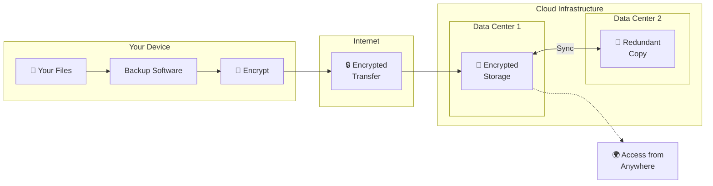

Cloud backup is the modern way to protect your digital life. Instead of storing copies of your files on external drives sitting in your drawer, cloud backup automatically sends your data to secure servers across the internet. This means your photos, documents, and memories stay safe even if your computer crashes, your house floods, or your laptop gets stolen.

Think of it as a safety deposit box in the sky. Your files are stored in professional data centers with redundant power, climate control, and round-the-clock security. You don't have to remember to do anything. The backup happens automatically in the background while you work.

## How Cloud Backup Works

Cloud backup operates through a simple but powerful process. First, you install backup software on your computer. This software scans your files, encrypts them for security, and uploads them to remote servers over your internet connection.

Once the initial backup completes, the software monitors your files for changes. When you create, modify, or delete files, the backup updates automatically. Most services use incremental backups after the first upload, meaning only changed portions of files transfer, saving time and bandwidth.

Your data travels through encrypted connections and remains encrypted while stored. Only you hold the decryption keys, ensuring no one else can access your files, not even the backup provider.

## Cloud Backup vs Cloud Storage

Many people confuse cloud backup with cloud storage, but they serve different purposes.

| Feature                   | Cloud Backup                      | Cloud Storage                         |
| ------------------------- | --------------------------------- | ------------------------------------- |
| **Primary Purpose**       | Disaster recovery                 | File access and sharing               |
| **File Sync**             | No, backups remain separate       | Yes, files sync across devices        |
| **Versioning**            | Extensive history kept            | Limited or no versioning              |
| **Ransomware Protection** | Yes, backups isolated from changes | No, ransomware spreads to synced files |
| **Recovery Focus**        | Full system restoration           | Individual file access                |
| **Best For**              | Complete data protection          | Collaboration and accessibility       |

Cloud storage services like Dropbox or Google Drive excel at collaboration and making files accessible from multiple devices. However, they're not true backups. When ransomware encrypts your files, those encrypted versions sync to the cloud. When you accidentally delete a file, it often disappears from cloud storage too.

Cloud backup creates immutable copies that remain unchanged regardless of what happens to your original files. Delete something by mistake? Your backup still has it. Ransomware strikes? Restore clean copies from before the attack.

## Benefits of Cloud Backup

Cloud backup offers advantages that traditional backup methods cannot match.

**Protection Against Physical Disasters**

Fires, floods, and theft destroy local backups along with your computer. Cloud backups survive because they live in geographically distributed data centers. Your data exists in multiple locations simultaneously, ensuring no single disaster can wipe it out.

**Automatic Operation**

Human error causes more backup failures than technical problems. Cloud backup removes the human element entirely. Once configured, it runs continuously without requiring you to remember anything. No plugging in drives, no clicking "backup now," no forgotten backup sessions.

**Accessibility Anywhere**

Traveling for work? Computer died at the worst possible moment? As long as you have internet access, you can restore your files to any device, anywhere in the world. This proves invaluable when you need critical documents while away from home.

**Scalability**

Running out of storage space on external drives creates headaches. Cloud backup scales effortlessly as your data grows. Start with a few gigabytes and expand to terabytes without buying new hardware or managing multiple drives.

## What to Look for in a Cloud Backup Service

Not all cloud backup services offer the same features. Here's what matters most.

| Feature                         | Why It Matters                                     |
| ------------------------------- | -------------------------------------------------- |
| **End-to-End Encryption**       | Ensures only you can read your files               |
| **Zero-Knowledge Architecture** | Provider cannot access your data even if compelled |
| **Incremental Backups**         | Saves bandwidth by only uploading changes          |
| **Version History**             | Allows restoring older file versions               |
| **Fast Restore Options**        | Speeds up recovery when you need files urgently    |
| **Cross-Platform Support**      | Backs up all your devices with one solution        |

**Encryption Standards**

Look for AES-256 encryption, the military-grade standard used by banks and governments. This ensures your data remains unreadable to anyone without your password.

**Zero-Knowledge Architecture**

Some services, including BlinkDisk, use zero-knowledge encryption. This means your data gets encrypted on your device before transmission, and only you hold the decryption keys. The service stores your files but cannot read them. Maximum privacy comes with responsibility. Lose your password and your data becomes unrecoverable.

**Retention Policies**

Check how long the service keeps deleted files and previous versions. Some keep versions for 30 days, others for years. Longer retention provides better protection against delayed discovery of problems.

## Setting Up Your First Cloud Backup

Getting started with cloud backup takes less time than you might expect.

**Choose What to Protect**

Start by identifying irreplaceable data: family photos, financial documents, work projects, creative files. Most people need 100-500 gigabytes for essential files, though photographers and videographers may require terabytes.

**Select Your Service**

Evaluate options based on your priorities. Budget-conscious users might prioritize cost per gigabyte. Privacy-focused individuals should emphasize zero-knowledge encryption. Those with large media collections need services supporting unlimited storage or high caps.

**Install and Configure**

Download the backup software and follow the setup wizard. Most services guide you through selecting folders, setting backup schedules, and choosing encryption options. The initial backup takes longest, so plan to run it overnight when internet usage doesn't interfere with other activities.

**Verify Your Backup**

Don't assume everything worked. After the first backup completes, test restoring a file. This confirms the backup functions correctly and familiarizes you with the restoration process before an emergency strikes.

## Common Cloud Backup Concerns

Users often worry about specific aspects of cloud backup. Let's address the most common concerns.

**"What if the service shuts down?"**

Reputable backup services provide export options allowing you to download all your data. Additionally, the 3-2-1 backup rule (three copies on two different media with one offsite) means cloud backup supplements rather than replaces other backup methods.

**"Can I trust the provider with my data?"**

Zero-knowledge encryption means you don't have to trust the provider. They store encrypted data they cannot read. Your privacy depends only on your password strength and your ability to keep it secret.

**"What about internet speed?"**

Initial backups take time, especially for large collections. However, modern backup software uses compression and block-level deduplication to minimize upload sizes. After the first backup, only changes upload, typically just megabytes per day for average users.

## When Cloud Backup Makes Sense

Cloud backup benefits nearly everyone, but certain situations make it especially valuable.

**Remote Workers**

Without IT departments managing backups, remote workers must protect their own data. Cloud backup ensures work files remain safe regardless of what happens to home office equipment.

**Small Businesses**

Cloud backup provides enterprise-level protection at small business prices, ensuring customer records, financial data, and operational files survive disasters.

**Families**

Children's photos cannot be recreated if lost. Cloud backup preserves these precious memories against every threat, from spilled coffee on laptops to house fires.

**Creative Professionals**

Photographers, videographers, designers, and musicians invest countless hours in their work. Cloud backup protects these irreplaceable creative assets against hardware failure and accidents.

## Conclusion

Cloud backup represents the easiest, most reliable way to protect your data in the digital age. By automatically copying your files to secure remote servers, it eliminates the risks of local storage while requiring virtually no effort on your part.

The combination of automatic operation, disaster protection, and accessibility from anywhere makes cloud backup essential for anyone who values their digital data. Whether you're protecting family memories, business records, or creative projects, cloud backup ensures your files survive whatever life throws at them.

Don't wait for disaster to strike. Set up cloud backup today and enjoy the peace of mind that comes from knowing your data remains safe, secure, and always within reach.
