Content-addressable storage (CAS) might sound technical, but the concept is elegantly simple. Instead of asking "where is my file?" you ask "what is my file?" and the system finds it based on what it contains, not where it lives.

This approach revolutionizes how modern backup systems store and manage data. By identifying files through their actual content, CAS eliminates duplicates automatically and ensures data integrity in ways traditional storage cannot match.

## How Content-Addressable Storage Works

Traditional storage systems use location-based addressing. You save a file to `/documents/report.pdf` and retrieve it from that same path. If you save the same file twice in different folders, you now have two copies consuming twice the space.

Content-addressable storage works differently. When you store a file, the system calculates a cryptographic hash, a unique fingerprint based on the file's contents. This hash becomes the file's address.

| Traditional Storage                     | Content-Addressable Storage                           |
| --------------------------------------- | ----------------------------------------------------- |
| Files stored by location path           | Files stored by content fingerprint                   |
| Same file in two locations = two copies | Same content = same address (automatic deduplication) |
| Paths can change or break               | Content hash never changes                            |
| Vulnerable to silent data corruption    | Corruption detected immediately via hash mismatch     |

Think of it like a library where books aren't shelved by category or author. Instead, every book gets a unique code based on every word inside it. Two identical books always share the same code, regardless of how many copies exist.

```mermaid
flowchart LR
    subgraph traditional["Traditional Storage"]
        path1["/docs/report.pdf"]
        path2["/backup/report.pdf"]
        file1["📄 File Copy 1"]
        file2["📄 File Copy 2"]
        path1 --> file1
        path2 --> file2
    end

    subgraph cas["Content-Addressable Storage"]
        content["📄 File Content"]
        hash["🔐 SHA-256 Hash"]
        address["Address: 8f7d3..."]
        ref1["ref: /docs/report.pdf"]
        ref2["ref: /backup/report.pdf"]
        content --> hash --> address
        ref1 --> address
        ref2 --> address
    end
```

## The Power of Cryptographic Hashing

The magic behind CAS is the hash function. This mathematical algorithm processes the file's contents and generates a fixed-length string of characters that uniquely identifies that exact data.

Even a single bit change, such as modifying one character in a document, produces a completely different hash. This property makes CAS incredibly reliable for detecting corruption or tampering.

## Why CAS Matters for Backups

Content-addressable storage transforms backup efficiency in three key ways.

**[Deduplication](/glossary/what-is-deduplication-in-backups) happens automatically.** Store the same photo in ten different folders, and CAS keeps only one copy. The system recognizes identical content and references the same stored data, significantly reducing storage requirements.

**Data integrity is built-in.** Every time you retrieve a file, the system verifies its hash matches what was originally stored. If a single bit flipped due to hardware degradation, you'll know immediately rather than discovering corrupted files years later.

**[Incremental backups](/glossary/what-is-an-incremental-backup) become incredibly efficient.** Traditional systems check file timestamps and sizes to detect changes. CAS knows instantly whether content changed by comparing hashes, enabling block-level deduplication within files themselves.

## Real-World Applications

Content-addressable storage powers many technologies you already use.

**Git version control** uses content addressing to track code changes. Each commit gets a unique hash based on its content, enabling efficient storage of project history.

**Blockchain systems** rely on CAS to ensure transaction integrity. Each block references the previous block's hash, creating an unbreakable chain of trust.

**Modern backup solutions** like Kopia (which powers BlinkDisk) use content-addressable storage to minimize storage costs while maximizing reliability. Your data gets chunked, hashed, and deduplicated automatically.

| Use Case                      | How CAS Helps                                      |
| ----------------------------- | -------------------------------------------------- |
| **Cloud backups**             | Reduced storage costs through global deduplication |
| **Enterprise archives**       | Compliance-friendly immutable storage              |
| **Distributed systems**       | Efficient data synchronization across nodes        |
| **Content delivery networks** | Fast retrieval based on content identity           |

## CAS vs Traditional Storage: A Practical Example

Imagine backing up a 100-page document. You save version 1, then make minor edits creating version 2.

Traditional storage keeps both complete files separately. That's 200 pages of storage for perhaps 5 pages of actual changes.

Content-addressable storage works differently. It breaks the document into chunks, hashes each one, and only stores unique chunks. If 95 pages remained unchanged between versions, those chunks aren't duplicated. Only the modified pages consume additional storage.

The result? Both versions stored with roughly 105 pages worth of space instead of 200.

## Limitations to Consider

Content-addressable storage isn't perfect for every scenario.

**Retrieval requires the hash.** Unlike browsing folders, accessing a specific file means knowing its content address. Applications using CAS must maintain separate indexes mapping human-readable names to content hashes.

**Performance overhead exists.** Calculating hashes requires computational resources. However, modern processors handle this so efficiently that the benefits far outweigh the costs for most backup use cases.

**Not ideal for frequently changing data.** Files that change constantly generate new hashes constantly. CAS works best for content that remains relatively stable between backups.

## The Future of Data Storage

Content-addressable storage represents a fundamental shift in how we think about data. Moving from "where is it?" to "what is it?" solves problems that have plagued storage systems for decades.

As data volumes explode and [ransomware](/glossary/what-is-ransomware) threats grow, the integrity guarantees and efficiency of CAS become increasingly valuable. Your backup isn't just a copy. It's a cryptographically verified, deduplicated archive you can trust.

Whether you're protecting family photos or critical business documents, understanding content-addressable storage helps you appreciate why modern backup solutions work so effectively. The technology quietly ensures your data remains safe, intact, and efficiently stored.
