Imagine if your bookshelf had twenty copies of the same book, all taking up precious space. Deduplication is the process of keeping just one copy and removing the rest. It's one of the most powerful ways to shrink backup sizes without losing any information.

Deduplication has transformed how modern backup systems work. Instead of storing multiple copies of identical data, smart algorithms identify and eliminate duplicates. This means you can back up more data using less storage than ever before.

## What Is Deduplication?

Deduplication is a storage optimization technique that identifies and removes duplicate data blocks. When multiple files contain identical chunks of information, deduplication stores just one instance and creates references for the rest.

Think of it like a library card catalog. Instead of buying a new book every time someone wants to borrow one, the library keeps a single copy and tracks who has it. Deduplication works the same way: one physical copy, many logical references.

This process happens automatically and transparently. You never notice it's working, but your storage requirements drop dramatically.

## How Deduplication Works

The magic happens through sophisticated algorithms that analyze your data at the block level. Your backup software breaks files into small chunks, typically 4KB to 128KB in size, and assigns each chunk a unique fingerprint.

When new data arrives for backup, the system compares it against existing chunks. If a chunk already exists in storage, only a reference pointer gets saved. If it's new, the chunk gets stored.

| Step                 | What Happens                               | Result                                     |
| -------------------- | ------------------------------------------ | ------------------------------------------ |
| **Chunking**         | Files are divided into small blocks        | Data becomes manageable pieces             |
| **Fingerprinting**   | Each chunk gets a unique hash              | Identical data gets identical fingerprints |
| **Comparison**       | New chunks are checked against stored ones | Duplicates are identified instantly        |
| **Storage Decision** | Only unique chunks are stored              | References point to existing duplicates    |

```mermaid
flowchart TB
    subgraph input["Input Files"]
        file1["📄 File A<br/>Blocks: A B C"]
        file2["📄 File B<br/>Blocks: A B D"]
    end

    subgraph process["Deduplication"]
        hash["🔐 Hash & Compare"]
    end

    subgraph storage["Stored (4 unique blocks)"]
        blockA["Block A"]
        blockB["Block B"]
        blockC["Block C"]
        blockD["Block D"]
    end

    file1 --> hash
    file2 --> hash
    hash --> blockA
    hash --> blockB
    hash --> blockC
    hash --> blockD
```

This block-level approach means deduplication works across different files and even different users. A document you share with a colleague only stores once, even if you both back it up separately.

## Types of Deduplication

Not all deduplication works the same way. Understanding the different approaches helps you choose the right solution for your needs.

| Type             | Where It Happens                       | Best For                         |
| ---------------- | -------------------------------------- | -------------------------------- |
| **Source-Side**  | On your computer before sending        | Limited bandwidth, cloud backups |
| **Target-Side**  | On the backup server or storage device | Fast local networks, NAS backups |
| **Inline**       | During the backup process              | Real-time optimization           |
| **Post-Process** | After backup completes                 | Minimizing backup time impact    |

### Source-Side Deduplication

Source-side deduplication happens on your computer before data ever leaves for backup storage. The software analyzes your files locally, sends only unique chunks to the cloud or backup server, and references everything else.

This approach shines when you have limited internet bandwidth. Instead of uploading that 10GB file you share with your team twenty times, you upload it once. The rest becomes simple reference updates.

### Target-Side Deduplication

Target-side deduplication occurs on the backup storage device itself. Your computer sends all data normally, and the storage system handles deduplication behind the scenes.

This method works well for local backups where bandwidth isn't a concern. It reduces the storage burden on your backup destination while keeping backup speeds fast on your source machine.

## Benefits of Deduplication

The advantages of deduplication extend far beyond simple space savings.

| Benefit                  | Impact                                         |
| ------------------------ | ---------------------------------------------- |
| **Storage Savings**      | Dramatically reduce backup sizes               |
| **Faster Backups**       | Less data to transfer means quicker completion |
| **Lower Costs**          | Less cloud storage and local disk required     |
| **Bandwidth Efficiency** | Perfect for remote and cloud backups           |
| **Longer Retention**     | Keep more backup versions with same storage    |
| **Environmental Impact** | Less storage hardware means lower energy use   |

Organizations with virtual machine environments see particularly dramatic results. Since VM templates and operating system files are nearly identical across instances, deduplication rates often exceed 90%.

## Deduplication vs Compression

These two technologies often work together, but they solve different problems.

| Feature             | Deduplication                           | Compression                 |
| ------------------- | --------------------------------------- | --------------------------- |
| **What It Does**    | Removes duplicate data blocks           | Shrinks individual files    |
| **Works Across**    | Multiple files and backups              | Single file only            |
| **Best For**        | Shared files, VM backups, email systems | Media, documents, databases |
| **Typical Savings** | 50-95%                                  | 20-80% per file             |

Compression squeezes individual files by finding patterns within them. Deduplication looks across your entire backup set to find identical chunks. Using both together delivers maximum space savings.

Think of compression like vacuum-sealing clothes for storage. Deduplication is like realizing you packed three identical sweaters and only keeping one. Together, they're incredibly effective.

## When Deduplication Matters Most

Certain scenarios make deduplication absolutely essential for practical backup strategies.

**Virtual Machine Backups**: Running multiple VMs means storing the same operating system files repeatedly. Deduplication collapses these redundancies, often reducing backup sizes by 70-95%.

**Email Systems**: Mail servers contain thousands of duplicate attachments. That PDF sent to fifty people stores once, not fifty times.

**File Shares and Collaboration**: Teams constantly share and version documents. Deduplication ensures only the actual changes consume new storage.

**Long-Term Archiving**: The longer you keep backups, the more duplicate data accumulates. Deduplication makes years of retention financially feasible.

## Best Practices for Deduplication

Getting the most from deduplication requires some strategic thinking.

**Keep It Default**: Modern backup solutions like BlinkDisk enable deduplication automatically. Don't disable it unless you have a specific reason.

**Understand Your Data**: Some data types deduplicate better than others. Encrypted files, already-compressed media, and random data see less benefit.

**Monitor Savings**: Most backup software shows your deduplication ratios. Watch these metrics to understand your storage efficiency.

**Plan for Growth**: Deduplication databases track all unique chunks. Very large datasets may require additional memory or processing power.

**Combine with Compression**: Use both technologies together for maximum efficiency. Deduplication first, then compression on the unique chunks.

## Conclusion

Deduplication has become the unsung hero of modern backup technology. By eliminating redundant data, it makes comprehensive backup strategies practical and affordable for everyone.

Whether you're protecting a single laptop or an entire data center, deduplication stretches your storage budget further. You get more protection, longer retention, and faster backups, all while using a fraction of the space.

The best part? Good backup software handles everything automatically. You don't need to understand the technical details to benefit from dramatically smaller backups. Just know that when you see your backup storage usage, deduplication is working hard behind the scenes to keep those numbers surprisingly low.
