Your personal photos, financial records, and private documents deserve real protection. End-to-end encryption ensures that only you hold the keys to your data, not backup companies, not cloud providers, not hackers. It's the gold standard for keeping your backups truly private.

When you back up without end-to-end encryption, you're essentially handing over a readable copy of everything to someone else. True end-to-end encryption changes this dynamic entirely, putting you back in complete control of your digital life.

## What Is End-to-End Encryption?

End-to-end encryption (E2EE) is a security system where data gets encrypted on your device before it ever travels to backup storage. Only you possess the decryption key, meaning no one, not even the backup service provider, can read your files.

Think of it like a safe deposit box where you keep the only key. The bank stores the box and protects it, but they can never open it or see what's inside. Even if someone breaks into the vault, your contents remain locked and unreadable.

This approach guarantees that your data stays confidential throughout its entire journey. From the moment it leaves your computer to whenever you decide to restore it, your information remains scrambled and inaccessible to anyone without your key.

## How End-to-End Encryption Works

The magic happens right on your own device. Before a single byte of data leaves your computer, specialized algorithms transform your files into unreadable ciphertext using a key that only you know.

| Stage               | What Happens                                | Who Can Access          |
| ------------------- | ------------------------------------------- | ----------------------- |
| **On Your Device**  | Files get encrypted using your unique key   | Only you                |
| **During Transfer** | Encrypted data travels through the internet | No one can read it      |
| **In Storage**      | Encrypted chunks remain scrambled           | Completely inaccessible |
| **Restoration**     | You decrypt files back on your device       | Back to readable form   |

```mermaid
flowchart LR
    subgraph device["Your Device"]
        files["📄 Your Files"]
        key["🔑 Your Key"]
        encrypt["🔐 Encrypt"]
        files --> encrypt
        key --> encrypt
    end

    subgraph transfer["Internet"]
        encrypted["🔒 Encrypted Data<br/><i>Unreadable</i>"]
    end

    subgraph cloud["Cloud Storage"]
        stored["💾 Stored Encrypted<br/><i>Provider cannot read</i>"]
    end

    subgraph restore["Restoration"]
        download["🔒 Download"]
        decrypt["🔓 Decrypt"]
        restored["📄 Your Files"]
        key2["🔑 Your Key"]
        download --> decrypt
        key2 --> decrypt
        decrypt --> restored
    end

    encrypt --> encrypted --> stored
    stored -.-> download
```

The encryption key never leaves your possession. Backup providers store only the encrypted blobs of data, which are mathematically impossible to crack without your key. Even if authorities subpoenaed your backup provider or hackers breached their servers, your actual files would remain gibberish to them.

Modern implementations use industry-standard algorithms like AES-256, the same encryption trusted by governments and militaries worldwide. These systems are designed to withstand attacks from even the most sophisticated adversaries.

## Why End-to-End Encryption Matters for Backups

Backups contain your entire digital life: tax returns, medical records, personal correspondence, and family memories. Without proper encryption, this treasure trove of sensitive information sits vulnerable to theft and misuse.

| Without E2EE                                   | With E2EE                                   |
| ---------------------------------------------- | ------------------------------------------- |
| Backup provider can read your files            | Only you can decrypt your data              |
| Hackers who breach servers access everything   | Stolen data remains unreadable garbage      |
| Employees might browse customer backups        | Mathematical impossibility to view contents |
| Government requests expose your information    | Provider can only hand over encrypted blobs |
| Ransomware attackers may target stored backups | Encrypted backups useless to criminals      |

Traditional cloud storage often encrypts data only during transfer or stores it encrypted but holds the keys themselves. This creates a vulnerability. If the provider gets compromised, your data goes with them. End-to-end encryption eliminates this risk by ensuring you alone control access.

## End-to-End Encryption vs. Regular Encryption

Not all encryption provides the same protection. Understanding the difference helps you choose truly secure backup solutions.

| Feature               | Transport/At-Rest Encryption  | End-to-End Encryption         |
| --------------------- | ----------------------------- | ----------------------------- |
| **Who Holds Keys**    | The service provider          | Only you                      |
| **Provider Can Read** | Yes, they decrypt when needed | No, mathematically impossible |
| **Protection Level**  | Good against outsiders        | Complete protection           |
| **Trust Required**    | Must trust the company        | Trust no one needed           |
| **Use Case**          | Basic security compliance     | Maximum privacy               |

Transport encryption protects data while it moves between your device and servers. At-rest encryption scrambles files on the provider's hard drives. But both approaches leave the provider capable of accessing your information whenever they choose.

End-to-end encryption removes this capability entirely. The provider becomes a mere storage vessel, incapable of understanding what they're holding no matter how hard they try.

## Common Concerns About End-to-End Encryption

Some people worry that stronger security means more hassle. Modern backup software has made these concerns largely obsolete.

**What if I forget my password?**

This is the trade-off for true security. If you lose your encryption key, not even the backup company can help you recover your files. The solution is simple: store your password in a dedicated password manager and keep a physical backup in a secure location like a safe deposit box.

**Doesn't encryption slow things down?**

Today's computers have specialized hardware that handles encryption with minimal performance impact. You might notice a slight delay during the first backup, but daily incremental backups proceed quickly and smoothly.

**Isn't this only for technical people?**

Modern backup applications handle all encryption automatically. You simply create a strong password during setup, and the software manages everything else behind the scenes. No technical knowledge required.

## Best Practices for Encrypted Backups

Getting the most from end-to-end encryption requires following some basic guidelines.

**Choose a Strong Password**: Your encryption is only as strong as your password. Use at least 16 characters combining letters, numbers, and symbols. Avoid dictionary words or personal information that others could guess.

**Never Share Your Key**: The moment you share your encryption password with anyone, you compromise the end-to-end protection. Keep it private and store it securely.

**Verify Encryption Claims**: Not all services advertising "encryption" actually provide end-to-end protection. Look for terms like "client-side encryption," "zero-knowledge," or "you hold the keys" to confirm true E2EE.

**Test Your Restores**: Periodically restore a file to ensure your encryption key works and you remember your password. A backup you cannot access is worthless.

## When End-to-End Encryption Is Essential

Certain situations make end-to-end encryption absolutely non-negotiable.

**Business Confidentiality**: Companies handling trade secrets, financial data, or client information must ensure competitors and insiders cannot access backups.

**Healthcare and Legal**: Professionals bound by HIPAA, attorney-client privilege, or GDPR requirements need encryption that prevents unauthorized access by anyone, including their backup provider.

**Journalism and Activism**: Individuals facing surveillance or threats from governments or corporations require the strongest possible protection for their sources and communications.

**Personal Privacy**: Everyone deserves privacy for their medical records, financial documents, and personal correspondence. End-to-end encryption ensures these remain truly private.

## Conclusion

End-to-end encryption transforms backups from a potential liability into a fortress for your digital life. By ensuring only you can read your data, it eliminates the trust required with traditional backup solutions.

The beauty of modern end-to-end encryption is its simplicity. Once set up, it works automatically and invisibly, protecting everything without complicating your daily routine. You get military-grade security with consumer-friendly convenience.

When choosing a backup solution, don't settle for less than true end-to-end encryption. Your data deserves the strongest protection available, and anything less leaves you vulnerable to breaches, insider threats, and surveillance. Take control of your privacy by encrypting your backups end-to-end.
