import { Image } from "astro:assets";
import screenshotLight from "../../assets/screenshots/light.png";

Ransomware has become one of the most feared threats in the digital world. This malicious software can lock you out of your entire digital life in seconds, holding your precious photos, important documents, and work files hostage until you pay a hefty ransom. Understanding ransomware is the first step toward protecting yourself from this growing menace.

Backups represent your strongest shield against ransomware attacks. When you have secure, up-to-date backups, cybercriminals lose their leverage. You can simply restore your files and refuse to pay, rendering the attack powerless.

<Image src="https://static.blinkdisk.com/blog/wannacry.jpg" width={1024} height={774} alt="Screenshot of WannaCry Ransomware" />

## What Is Ransomware?

Ransomware is a type of malware designed to deny access to your computer system or personal files until a sum of money is paid. It works by encrypting your data with a key known only to the attackers, effectively locking you out of your own information.

Think of it like a digital kidnapping. The criminals take something valuable, your data, and demand payment for its safe return. Unlike traditional theft, they don't actually steal your files; they simply make them inaccessible to you while keeping them on your device.

Most ransomware spreads through phishing emails, malicious downloads, or vulnerabilities in outdated software. Once it infects your system, it quietly encrypts files in the background before displaying a ransom demand.

## How Ransomware Attacks Work

Understanding the typical ransomware attack pattern helps you recognize and prevent infections before they cause damage.

| Stage          | What Happens                                       | Timeframe |
| -------------- | -------------------------------------------------- | --------- |
| **Infection**  | Malware enters through email, download, or exploit | Minutes   |
| **Encryption** | Files get locked with unbreakable encryption       | Hours     |
| **Demand**     | Ransom note appears with payment instructions      | Immediate |
| **Pressure**   | Threats escalate, deadlines shorten                | Days      |

```mermaid
flowchart TB
    attack["⚠️ Ransomware Attack"]
    encrypted["🔒 Files Encrypted"]

    attack --> encrypted

    encrypted --> choice["What Are Your Options?"]

    choice --> pay["💸 Pay Ransom"]
    choice --> restore["💾 Restore from Backup"]

    pay --> maybe["❓ Maybe Get Files Back<br/><i>No guarantee</i>"]
    pay --> targeted["🎯 Marked as Target<br/><i>May attack again</i>"]

    restore --> wipe["🧹 Wipe Infected System"]
    wipe --> recovered["✅ Files Restored<br/><i>Back to normal</i>"]
```

The encryption used by modern ransomware is virtually unbreakable. These programs use the same encryption standards that protect military secrets and banking systems. Without the decryption key held by the attackers, recovering your files is mathematically impossible.

Attackers typically demand payment in cryptocurrency like Bitcoin because it's difficult to trace. They may threaten to delete your files, publish sensitive information online, or increase the ransom amount if you don't pay quickly.

## Why Ransomware Is So Dangerous

Ransomware poses unique threats that make it particularly devastating for individuals and businesses alike.

| Threat               | Impact                              | Why It Matters                                     |
| -------------------- | ----------------------------------- | -------------------------------------------------- |
| **Data Loss**        | Permanent destruction of files      | Years of memories and work can vanish instantly    |
| **Financial Damage** | Ransom payments plus recovery costs | Average ransom demands exceed thousands of dollars |
| **Downtime**         | Inability to work or access systems | Business operations can halt for days or weeks     |
| **Reputation**       | Loss of customer and partner trust  | Clients may take their business elsewhere          |

Unlike other malware that might steal data quietly, ransomware announces itself immediately. The psychological pressure is intense. You see your files locked, read threatening messages, and face a ticking clock demanding immediate action.

Many victims feel they have no choice but to pay. However, paying the ransom doesn't guarantee you'll get your files back. Studies show that a significant percentage of victims who pay never receive working decryption keys.

## How Backups Protect Against Ransomware

Backups transform ransomware from a catastrophe into a minor inconvenience. When your data exists safely in another location, attackers have nothing to hold hostage.

| Scenario               | Without Backups                             | With Backups                         |
| ---------------------- | ------------------------------------------- | ------------------------------------ |
| **Ransomware Strikes** | Total panic, consider paying ransom         | Annoying but manageable              |
| **Recovery Options**   | Negotiate with criminals or lose everything | Restore from backup, resume work     |
| **Financial Impact**   | Ransom payment + recovery costs             | Just time to restore                 |
| **Data Safety**        | Files may be lost forever                   | Everything returns exactly as it was |

The key is maintaining backups that ransomware cannot reach. If your backup drive stays connected to your computer during an attack, the ransomware may encrypt your backups too. This is why the [3-2-1 backup rule](/glossary/what-is-the-3-2-1-backup-rule) is so effective against ransomware. It requires three copies of your data, on two different media types, with one stored [offsite](/glossary/what-is-an-offsite-backup).

[Cloud backups](/glossary/what-is-cloud-backup) with [end-to-end encryption](/glossary/what-is-end-to-end-encryption-in-backups) provide excellent ransomware protection. Since the encryption happens on your device before upload, and you hold the only decryption key, ransomware cannot touch files already safely stored in the cloud.

<Image src={screenshotLight} alt="Screenshot of the BlinkDisk backup app" />

## Types of Ransomware

Not all ransomware works the same way. Understanding the different types helps you recognize various attack methods.

| Type                        | How It Works                                                 | Common Examples          |
| --------------------------- | ------------------------------------------------------------ | ------------------------ |
| **Crypto Ransomware**       | Encrypts individual files, demands ransom for decryption key | Locky, CryptoLocker      |
| **Locker Ransomware**       | Locks the entire computer, preventing any access             | WinLocker, Police Locker |
| **Double Extortion**        | Encrypts files AND threatens to leak stolen data             | Maze, Sodinokibi         |
| **Ransomware-as-a-Service** | Pre-built ransomware sold to less technical criminals        | DarkSide, REvil          |

Crypto ransomware is the most common type today. It targets your documents, photos, videos, and other valuable files while often leaving the operating system functional so you can see the ransom demand.

Double extortion has become increasingly popular among cybercriminals. Even if you have backups and refuse to pay for decryption, they threaten to publish sensitive data online, sell it to competitors, or report you to regulators for data breaches.

## Signs of a Ransomware Infection

Recognizing ransomware early can limit the damage. Watch for these warning signs.

**Unexpected File Changes**

Your files may suddenly have strange extensions appended to their names, such as `.locked`, `.encrypted`, or `.crypto`. This indicates the ransomware has already begun encrypting your data.

**Slow System Performance**

Ransomware consumes significant computing power while encrypting files. If your computer suddenly becomes sluggish or unresponsive, malware might be working in the background.

**Ransom Notes**

The most obvious sign is the appearance of ransom notes. These usually appear as text files on your desktop, pop-up windows, or even as your new desktop wallpaper. They explain what happened and how to pay.

## What to Do If You're Infected

If ransomware hits your system, staying calm and following a clear plan minimizes the damage.

**Isolate the Infection Immediately**

Disconnect your computer from the internet and any network connections. Unplug external drives and USB devices. This prevents the ransomware from spreading to other computers or encrypting additional backups.

**Do Not Pay the Ransom**

Paying encourages more attacks and doesn't guarantee recovery. There's no honor among thieves. Many victims pay and still don't receive working decryption keys. Others get targeted again because they've proven willingness to pay.

**Restore from Backup**

If you have clean backups from before the infection, use them to restore your system completely. Wipe the infected computer entirely to ensure no ransomware remnants remain, then restore your files from backup. This is why [disaster recovery](/glossary/what-is-disaster-recovery) planning is essential.

**Report the Incident**

Contact law enforcement and report the attack to organizations like the FBI's Internet Crime Complaint Center. While they may not recover your files, reporting helps authorities track ransomware gangs and potentially develop decryption tools.

## Ransomware Prevention Best Practices

Preventing ransomware is far easier than recovering from it. Implement these protective measures to reduce your risk.

| Practice                 | How It Helps                                | Priority |
| ------------------------ | ------------------------------------------- | -------- |
| **Regular Backups**      | Provides clean data recovery option         | Critical |
| **Update Software**      | Patches vulnerabilities ransomware exploits | High     |
| **Email Vigilance**      | Blocks primary ransomware delivery method   | High     |
| **Antivirus Software**   | Detects and blocks known ransomware         | Medium   |
| **Network Segmentation** | Limits spread across connected devices      | Medium   |

Keep your operating system and all applications updated with the latest security patches. Ransomware often exploits known vulnerabilities that software updates have already fixed.

Be extremely cautious with email attachments and links, even from people you know. Verify unexpected attachments through a separate communication channel before opening them.

Use reputable antivirus and anti-malware software. While not foolproof, these tools catch many ransomware variants before they can encrypt your files.

## Conclusion

Ransomware represents one of the most significant digital threats facing individuals and organizations today. Its ability to instantly lock away years of valuable data creates genuine panic and desperation among victims.

However, ransomware only wins when you have no alternatives. Comprehensive backup strategies completely neutralize this threat. When you maintain current backups stored safely offline or in secure cloud storage with end-to-end encryption, attackers lose all leverage.

Don't wait for disaster to strike. Set up a robust backup system today, follow the 3-2-1 rule, and test your restores regularly. Ransomware may be scary, but with proper backups, it becomes nothing more than a temporary inconvenience.

Your data deserves protection. Take action now to ensure that if ransomware ever comes knocking, you'll be ready to show it the door.
