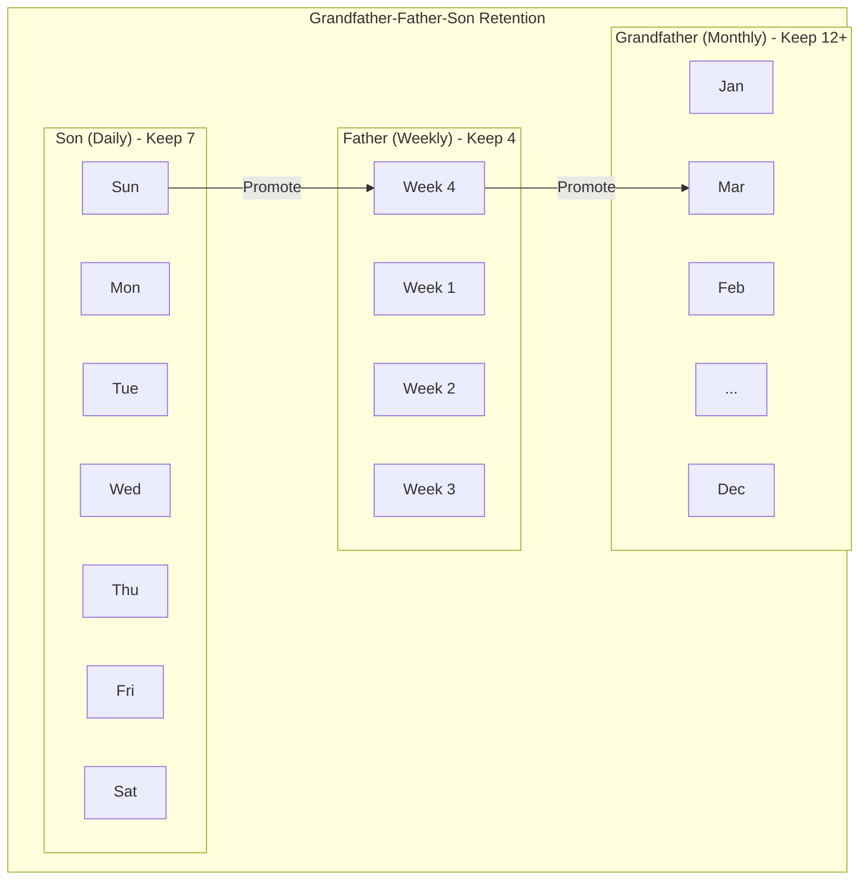

Imagine having a safety net that automatically adjusts its size based on your needs. Retention in backups works exactly like that. It decides how long your backup copies stick around before making room for newer ones. It's the difference between keeping yesterday's files forever and having a smart system that knows when to let go.

Retention policies have become essential for anyone serious about data protection. They help you balance the need for historical data against storage costs and compliance requirements, ensuring you keep exactly what you need without drowning in unnecessary copies.

## What Is Retention?

Retention refers to the length of time backup data is stored before being automatically deleted or archived. It's a critical component of any backup strategy that determines how far back you can recover files, emails, or entire systems.

Think of retention like a library's borrowing policy. Some books you can keep for two weeks, others for a month, and reference materials might stay forever. Similarly, retention policies define how long different types of backups remain available for recovery.

Every backup system uses retention, whether you realize it or not. Without a retention policy, your storage would eventually fill up with ancient backups you'd never need. With smart retention, you keep the right data for the right amount of time.

## How Retention Policies Work

Retention policies operate automatically once configured. They continuously monitor your backup repository and remove older backups according to the rules you've established.

| Component              | Function                                 | Example                              |
| ---------------------- | ---------------------------------------- | ------------------------------------ |
| **Retention Period**   | Defines how long backups are kept        | Keep daily backups for 30 days       |
| **Retention Schedule** | Specifies backup frequency and types     | Hourly, daily, weekly, monthly       |
| **Retention Rules**    | Determines what gets deleted when        | Remove oldest daily after 30 days    |
| **Archival Policy**    | Moves older backups to long-term storage | Archive monthly backups after 1 year |

The process works behind the scenes without interrupting your backups. As new backups arrive, the system checks existing ones against your policy. Backups that exceed their retention period are flagged for deletion or moved to cheaper archival storage.

Most modern backup solutions allow different retention periods for different backup types. You might keep hourly snapshots for just 24 hours, daily backups for a month, and monthly backups for several years.

## Types of Retention Policies

Different scenarios call for different retention approaches. Understanding these helps you choose the right strategy for your specific needs.

| Policy Type     | Best For                            | Typical Duration |
| --------------- | ----------------------------------- | ---------------- |
| **Short-term**  | Quick recovery from recent mistakes | 7-30 days        |
| **Medium-term** | Standard business operations        | 30-90 days       |
| **Long-term**   | Compliance and historical reference | 1-7 years        |
| **Infinite**    | Archival and legal requirements     | Forever          |

### Short-term Retention

Short-term retention focuses on immediate recovery needs. It keeps recent backups that help you recover from accidental deletions, software bugs, or recent system failures.

This approach works well for rapidly changing data where yesterday's version matters more than last year's. Development environments, temporary project files, and cache data often use short-term retention.

### Long-term Retention

Long-term retention addresses compliance, legal discovery, and historical analysis needs. Industries like healthcare, finance, and legal services often require keeping data for years or even decades. This is a key part of [disaster recovery](/glossary/what-is-disaster-recovery) planning.

These policies balance storage costs against regulatory requirements. [Cloud storage](/glossary/what-is-cloud-backup) makes long-term retention more affordable, with options like Glacier or cold storage reducing costs for rarely accessed archives.

## Why Retention Matters

Proper retention policies deliver significant benefits that go beyond simple storage management.

**Cost Control**: Storage isn't free. Smart retention prevents paying for backups you'll never use while ensuring you keep what matters.

**Compliance Adherence**: Many regulations require keeping data for specific periods. GDPR, HIPAA, and SOX all have retention requirements. Good policies ensure you meet these obligations without over-retaining.

**Recovery Point Options**: Longer retention means more recovery options. If you discover data corruption from three months ago, adequate retention lets you restore from that period.

**Storage Performance**: Removing old backups keeps your backup repository lean. This improves backup and recovery speeds while reducing system overhead.

**Legal Protection**: In litigation, having the right retention policy demonstrates due diligence. It shows you're neither destroying evidence prematurely nor hoarding unnecessary data.

## Retention Best Practices

Getting retention right requires balancing multiple factors. Follow these guidelines to build an effective policy.

**Start With Your Recovery Needs**: Before setting retention periods, ask how far back you might need to recover. Most personal users need 30-90 days. Businesses often need 1-7 years.

**Consider Compliance Requirements**: Research regulations affecting your industry. Healthcare providers need HIPAA-compliant retention. Financial services follow SEC and FINRA rules.

**Implement Tiered Retention**: Don't use one-size-fits-all retention. Combine frequent short-term backups with less frequent long-term archives for optimal coverage.

| Backup Type | Frequency   | Retention Period | Purpose             |
| ----------- | ----------- | ---------------- | ------------------- |
| **Hourly**  | Every hour  | 24 hours         | Rapid recovery      |
| **Daily**   | Every day   | 30 days          | Standard operations |
| **Weekly**  | Every week  | 12 weeks         | Weekly milestones   |
| **Monthly** | Every month | 12 months        | Monthly archives    |
| **Yearly**  | Every year  | 7+ years         | Compliance archives |

**Test Your Policy**: Don't set retention and forget it. Periodically verify that old backups are being removed correctly and that you can still recover from retained backups.

**Document Everything**: Write down your retention policy and the reasoning behind it. This helps with audits, compliance reviews, and knowledge transfer.

**Review Regularly**: Business needs change. Review your retention policy annually to ensure it still meets your recovery and compliance requirements.

## Retention Challenges

Even well-planned retention policies face obstacles. Understanding these helps you avoid common pitfalls.

**Storage Growth**: Data grows exponentially. A retention policy that worked last year might strain storage this year. Monitor growth trends and adjust accordingly.

**Regulatory Changes**: Laws and regulations evolve. Yesterday's retention policy might not meet tomorrow's compliance requirements. Stay informed about regulatory updates.

**Application Dependencies**: Some applications require specific retention periods. Email systems, databases, and collaboration tools might have unique needs that override general policies.

**Version Control Conflicts**: Retention policies sometimes conflict with versioning needs. You might need to keep certain versions longer than the standard policy allows.

## The Grandfather-Father-Son Strategy

One of the most popular retention approaches uses a generational metaphor that many organizations follow. This works particularly well with [full backups](/glossary/what-is-a-full-backup), [differential backups](/glossary/what-is-a-differential-backup), and [incremental backups](/glossary/what-is-an-incremental-backup).

| Generation      | Frequency | Retention  | Example                  |
| --------------- | --------- | ---------- | ------------------------ |
| **Son**         | Daily     | 7 days     | Last 7 daily backups     |
| **Father**      | Weekly    | 4 weeks    | Last 4 weekly backups    |
| **Grandfather** | Monthly   | 12+ months | Last 12+ monthly backups |

This strategy provides excellent coverage while controlling storage costs. You get frequent recent backups for operational recovery and older backups for historical reference or compliance.

The beauty of this approach is its simplicity and effectiveness. It automatically creates a natural hierarchy of backups without complex rules or manual intervention.

## Conclusion

Retention is the unsung hero of backup strategy. While everyone focuses on creating backups, smart retention ensures those backups serve their purpose without becoming a burden.

The right retention policy gives you peace of mind. You know you can recover from yesterday's mistake or last year's data loss. At the same time, you're not drowning in unnecessary copies that waste money and complicate recovery.

Whether you're protecting family photos or enterprise databases, take time to design a retention policy that fits your needs. Start with your recovery requirements, factor in any compliance obligations, and implement a tiered approach that balances coverage with cost.

Remember that retention isn't set-and-forget. Review your policy periodically as your data grows and regulations change. A well-maintained retention policy keeps your backup system lean, compliant, and ready when disaster strikes.
