The 3-2-1 backup rule is the gold standard for keeping your data safe. This simple formula has protected countless businesses and individuals from losing everything when disaster strikes.

Think of it as the golden rule of backups. It's easy to remember, simple to implement, and incredibly effective at ensuring your data survives almost any catastrophe.

## What Is the 3-2-1 Backup Rule?

The 3-2-1 backup rule breaks down into three key numbers:

| Number | Meaning                     | Purpose                          |
| ------ | --------------------------- | -------------------------------- |
| **3**  | Three copies of your data   | Provides redundancy against loss |
| **2**  | Two different storage media | Protects against media failure   |
| **1**  | One copy stored offsite     | Survives local disasters         |

```mermaid
flowchart TB
    subgraph three["3 Copies"]
        original["💻 Original Data<br/>Your Computer"]
        backup1["💾 Backup 1<br/>External Drive"]
        backup2["☁️ Backup 2<br/>Cloud Storage"]
    end

    subgraph two["2 Media Types"]
        media1["Local Storage<br/>(SSD/HDD)"]
        media2["Cloud/Remote<br/>(Different Technology)"]
    end

    subgraph one["1 Offsite"]
        offsite["🌍 Geographic<br/>Separation"]
    end

    original --> backup1
    original --> backup2
    backup1 -.-> media1
    backup2 -.-> media2
    backup2 -.-> offsite
```

This rule was popularized by photographer Peter Krogh in his 2005 book on digital asset management. It has since become the industry standard for data protection across homes, small businesses, and enterprises worldwide.

The beauty of this rule lies in its simplicity. You don't need expensive equipment or technical expertise. Anyone can follow these guidelines to protect their photos, documents, and important files.

## Breaking Down the Rule

Let's examine each component of the 3-2-1 backup rule to understand why it works so well.

### Three Copies of Your Data

Your first copy is the original data on your computer. The second and third copies are backups that exist elsewhere. Having three total copies means you can lose two and still recover everything.

This redundancy protects against multiple failure scenarios. A single backup might fail, get corrupted, or become outdated. With three copies, you always have options.

### Two Different Storage Media Types

Storing backups on different media types prevents a single point of failure. If both copies were on identical external drives from the same manufacturer, a firmware bug could destroy both simultaneously.

| Primary Storage     | Secondary Media Options     |
| ------------------- | --------------------------- |
| Internal hard drive | External hard drive         |
| SSD                 | Cloud storage               |
| NAS device          | USB flash drive             |
| Computer            | Optical discs (DVD/Blu-ray) |
| Phone               | Network storage             |

Mixing media types spreads your risk. A mechanical hard drive failure won't affect your cloud backup. A cloud service outage won't impact your local external drive.

### One Copy Stored Offsite

The offsite copy is your insurance against local disasters. Fires, floods, theft, and natural disasters can destroy everything in your home or office at once.

An offsite backup exists in a physically separate location. This could be:

- Cloud storage service
- External drive at a friend's house
- Safety deposit box
- Office location (for home backups)

Geographic separation ensures that a regional disaster won't wipe out all your data. When local backups fail, your offsite copy remains safe.

## Why the 3-2-1 Rule Works

The 3-2-1 backup rule addresses the most common causes of data loss through strategic redundancy.

| Threat              | How 3-2-1 Protects You              |
| ------------------- | ----------------------------------- |
| Hard drive failure  | Multiple copies on different drives |
| Ransomware          | Offsite/air-gapped backup survives  |
| Fire/Flood          | Offsite copy remains safe           |
| Theft               | Copy stored elsewhere unaffected    |
| Accidental deletion | Previous backup versions available  |
| Software corruption | Multiple restore points             |

Each layer of protection addresses different risks. Local backups handle hardware failure and human error. The offsite backup handles physical disasters. Multiple media types prevent systemic failures.

## Real-World Examples

Understanding how to apply the 3-2-1 rule makes implementation easier. Here are practical examples for different scenarios.

### Home User Setup

A typical home implementation might look like this:

1. **Original data**: Photos and documents on your laptop
2. **First backup**: External hard drive connected to your computer
3. **Second backup**: Cloud storage service like BlinkDisk

Your laptop and external drive represent two different media types. The cloud backup serves as your offsite copy. This setup costs little and runs automatically.

### Small Business Setup

A small business might implement the rule differently:

1. **Original data**: Server files and workstations
2. **First backup**: Network-attached storage (NAS) device
3. **Second backup**: Cloud backup service with geographic redundancy

The server and NAS are different media types. The cloud backup provides offsite protection. This setup offers fast local recovery and disaster-proof remote storage.

### Professional Photographer Setup

Photographers with massive raw image libraries need careful planning:

1. **Original data**: Working files on fast SSD
2. **First backup**: External RAID array for redundancy
3. **Second backup**: Cloud archive storage for long-term protection

The SSD and RAID array provide different media types. Cloud storage ensures offsite protection for irreplaceable creative work.

## Common Mistakes to Avoid

Many people think they're following the 3-2-1 rule when they're actually leaving themselves vulnerable. Watch out for these pitfalls.

### Same Location Storage

Keeping your external backup drive right next to your computer doesn't satisfy the offsite requirement. A fire, flood, or break-in can destroy both.

### RAID Is Not a Backup

A RAID array protects against drive failure but isn't a true backup. It doesn't protect against ransomware, accidental deletion, or software corruption. You still need separate backup copies.

### Version Confusion

Some backup software creates multiple versions but stores them on the same drive. This doesn't count as multiple copies. True redundancy requires physically separate storage.

### Forgetting to Test

Backups you cannot restore are worthless. Regularly verify that your offsite backup works by testing file restoration. Don't wait until disaster strikes to discover problems.

## The 3-2-1-1-0 Rule: An Evolution

Some experts have expanded the 3-2-1 rule to address modern threats like ransomware. This enhanced version adds two more requirements:

| Extension | Meaning                     | Purpose                     |
| --------- | --------------------------- | --------------------------- |
| **+1**    | One offline/air-gapped copy | Survives ransomware attacks |
| **+0**    | Zero errors verified        | Confirms backup integrity   |

The offline copy exists on disconnected media like an unplugged external drive or optical discs. Ransomware cannot encrypt what it cannot access.

Zero errors means regularly testing restores to verify backup integrity. A backup with errors provides false security.

## Implementing the 3-2-1 Rule Today

Starting your 3-2-1 backup strategy is easier than you think. Follow these steps to protect your data today.

### Step 1: Audit Your Current Setup

Count your current copies. Do you have three total? Are they on different media? Is one offsite? Most people discover they have only one or two copies, all in the same location.

### Step 2: Add a Local Backup

Purchase an external hard drive and set up automatic backups. This creates your second copy and introduces a different media type. Schedule daily or weekly backups depending on how often your data changes.

### Step 3: Set Up Offsite Protection

Choose a cloud backup service or establish a physical offsite rotation. Cloud services offer convenience and automation. Physical rotation provides control and works without internet.

### Step 4: Automate Everything

Manual backups get forgotten. Configure automatic backup software to run on a schedule. Set up monitoring to alert you if backups fail.

### Step 5: Test and Verify

Perform trial restores quarterly. Make sure you can actually recover files from each backup location. Document the restoration process so you remember how during stressful situations.

## Tools That Support 3-2-1

Many modern backup solutions are designed around the 3-2-1 rule. Look for software that supports:

| Feature               | Why It Matters                                  |
| --------------------- | ----------------------------------------------- |
| Multiple destinations | Back up to local drive and cloud simultaneously |
| Versioning            | Keep multiple restore points over time          |
| Encryption            | Protect data during transfer and storage        |
| Verification          | Confirm backup integrity automatically          |
| Scheduling            | Automate backups without manual intervention    |

BlinkDisk, for example, simplifies 3-2-1 implementation by supporting local and cloud backups with strong encryption and automatic operation.

## Beyond 3-2-1: Enterprise Considerations

Large organizations often need more comprehensive protection than the basic 3-2-1 rule provides.

### Geographic Distribution

Global enterprises store backups across multiple continents. This protects against regional disasters and ensures data availability even during widespread outages.

### Immutable Backups

Modern ransomware can encrypt or delete cloud backups. Immutable storage prevents modification or deletion for a specified period, ensuring you always have a clean restore point.

## Is 3-2-1 Still Relevant?

Some people question whether the 3-2-1 rule remains valid in the cloud era. The answer is absolutely yes.

Cloud storage actually makes following the rule easier. Your cloud backup serves as both a different media type and your offsite copy. The rule adapts to modern technology while maintaining its core principles.

The threats haven't changed. Hardware still fails. Disasters still happen. Human error still deletes important files. The 3-2-1 rule addresses these timeless risks with proven redundancy.

## Conclusion

The 3-2-1 backup rule remains the simplest, most effective way to protect your data. Three copies on two different media with one offsite provides comprehensive protection against virtually any data loss scenario.

Don't overthink it. Don't wait for the perfect solution. Start with the basics: your computer, an external drive, and a cloud service. That's all you need to implement 3-2-1 today.

Your data is irreplaceable. Family photos, important documents, and creative work cannot be recreated if lost. The 3-2-1 backup rule ensures they never have to be.

Start protecting your data now. Set up that external drive. Sign up for cloud backup. Follow the rule and sleep soundly knowing your digital life is safe.
